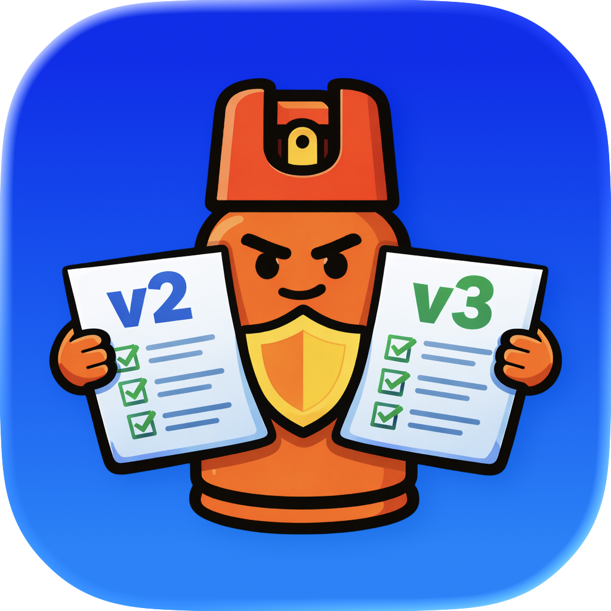
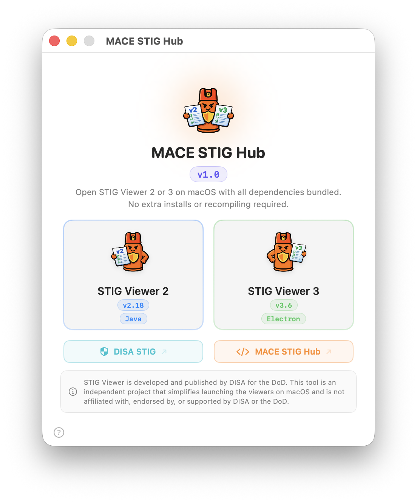
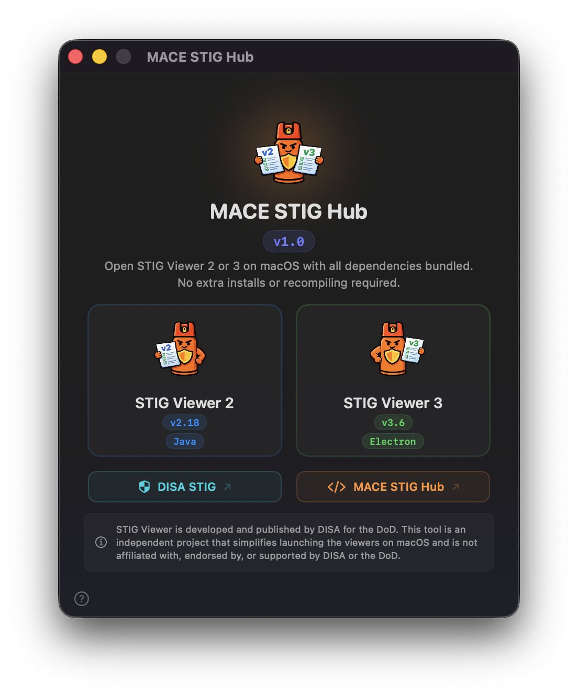

<p align="center">
  
</p>

<h1 align="center">MACE STIG Hub</h1>
<p align="center"><strong>Launch STIG Viewer 2 and 3 on macOS — no Java install, no recompiling, no hassle.</strong></p>

<p align="center">
  
  <a href="https://github.com/mace-app/mace-stig-hub/releases">
    
  </a>
  <a href="https://github.com/mace-app/mace-stig-hub/releases">
    
  </a>
  <a href="https://github.com/mace-app/mace-stig-hub/blob/main/LICENSE">
    
  </a>
</p>

## Contents
- [About](#about)
- [Why MACE STIG Hub?](#why-mace-stig-hub)
- [Quick Start](#quick-start)
- [Screenshots](#screenshots)
- [What's Bundled](#whats-bundled)
- [Features](#features)
- [For Developers — Building from Source](#for-developers--building-from-source)
- [Requirements](#requirements)
- [Disclaimer](#disclaimer)
- [Community & Feedback](#community--feedback)
- [Credits](#credits)

## About

MACE STIG Hub is a native macOS app that bundles everything you need to run **STIG Viewer 2** (Java) and **STIG Viewer 3** (Electron) — with zero setup. No Java installs, no Homebrew, no recompiling Electron from source. Just open the app and click launch.

**The problem:** Running STIG Viewer on macOS has always been a pain. SV2 requires a Java runtime that Apple no longer ships. SV3 is an Electron app that DISA distributes for Windows and Linux but doesn't officially support on macOS. Getting either one running means hunting down the right JRE, fixing permissions, or extracting and repackaging Electron binaries.

**The solution:** MACE STIG Hub packages both viewers with their dependencies into a single signed and notarized macOS app. It automatically detects your Mac's architecture (Apple Silicon or Intel) and launches the correct version. One download, two viewers, zero configuration.

**Built for:**
- Security Engineers & STIG Assessors
- macOS Administrators
- Government & DoD IT Teams
- Anyone who needs STIG Viewer on a Mac

## Why MACE STIG Hub?

| | |
|---|---|
| **Zero setup** | No Java install, no Homebrew, no terminal commands |
| **Both viewers in one app** | STIG Viewer 2 (Java) and STIG Viewer 3 (Electron) side by side |
| **Universal binary** | Runs natively on Apple Silicon and Intel Macs |
| **Architecture-aware** | Automatically selects the right JRE and Electron build for your chip |
| **Signed & notarized** | Passes Gatekeeper — no need to bypass security warnings |
| **Native macOS app** | Built with SwiftUI for a clean, lightweight experience |
| **Free & open source** | Community-driven, no licensing fees |

## Quick Start

> **Just want to run STIG Viewer on your Mac?** Download the app — everything is included. No Java, no setup, no terminal.
>
> **Want to build it yourself or contribute?** See [For Developers — Building from Source](#for-developers--building-from-source) below.

1. **Download** the [latest release](https://github.com/mace-app/mace-stig-hub/releases)
2. **Open** MACE STIG Hub
3. **Click** STIG Viewer 2 or STIG Viewer 3
4. That's it — no configuration needed

## Screenshots

<table>
<tr>
<td align="center">
  
  <p align="center"><em>Light mode</em></p>
</td>
<td align="center">
  
  <p align="center"><em>Dark mode</em></p>
</td>
</tr>
</table>

## What's Bundled

| Component | Version | Notes |
|-----------|---------|-------|
| **STIG Viewer 2** | v2.18 | Bundled Java runtime included — no install needed |
| **STIG Viewer 3** | v3.7 | Bundled runtime included — no install needed |

## Features

### One-Click Launch
- Launch STIG Viewer 2 or 3 with a single click
- Architecture detection automatically selects the correct binaries
- Toast notifications confirm successful launch or report errors

### Fully Self-Contained
- Bundled JRE — no system Java required for STIG Viewer 2
- Bundled Electron app — no recompiling or extracting for STIG Viewer 3
- All dependencies live inside the app bundle

### Native macOS Experience
- Built with SwiftUI for macOS 14+
- Light and dark mode support with adaptive app icon
- Signed with Developer ID and notarized by Apple
- Hardened Runtime enabled for all binaries

### Quick Access Links
- Direct link to DISA STIG/SRG resources
- Link to the project GitHub page

### System Info
- View app version, build info, and system details
- Copy diagnostics to clipboard for troubleshooting

## For Developers — Building from Source

> **Just want to run STIG Viewer on your Mac?** Download the [latest release](https://github.com/mace-app/mace-stig-hub/releases) — everything is pre-built and bundled for you. The steps below are only for contributors who want to build or update the app themselves.

The `BundledResources/` folder is not included in the repository because it's too large (~1.4 GB) to store in git. When you build the app, Xcode copies everything from this folder into the final `.app` bundle automatically — that's what makes MACE STIG Hub self-contained for end users.

To build the project:

1. Download `BundledResources.zip` from the [latest release](https://github.com/mace-app/mace-stig-hub/releases)
2. Unzip it into the project root so the folder structure looks like this:

```
BundledResources/
├── jre-arm64/              # Java runtime for Apple Silicon Macs (so SV2 works without installing Java)
├── jre-x64/                # Java runtime for Intel Macs
├── STIGViewer-2.18.jar     # STIG Viewer 2 from DISA
├── stigviewer2.icns        # STIG Viewer 2 app icon
├── sv3-arm64/              # STIG Viewer 3 built for Apple Silicon Macs
│   └── STIG Viewer 3.app/
└── sv3-x64/                # STIG Viewer 3 built for Intel Macs
    └── STIG Viewer 3.app/
```

3. Open `MACESTIGHub.xcodeproj` in Xcode
4. Build and run

### Updating components yourself

If you're updating to a newer version of a component:

| Component | Source |
|-----------|--------|
| **BellSoft Liberica JRE 21** | Download the Full JRE for macOS from [bell-sw.com](https://bell-sw.com/pages/downloads/#jdk-21-lts) — get both `aarch64` and `x86_64` builds |
| **STIGViewer-2.18.jar** | Download from [DISA STIG/SRG Tools](https://cyber.mil/stigs/srg-stig-tools/) — extract the JAR from the zip |
| **STIG Viewer 3** | See [Building STIG Viewer 3 for macOS](#building-stig-viewer-3-for-macos) below |

### Building STIG Viewer 3 for macOS

**Why is this necessary?** DISA only releases STIG Viewer 3 for Windows and Linux — there is no official macOS build. Under the hood, SV3 is an [Electron](https://www.electronjs.org/) app, which means its application code can be extracted from the Linux release and dropped into a macOS Electron shell to make it run natively on a Mac. MACE STIG Hub does all of this for you ahead of time so end users never have to touch any of it.

If you need to update SV3 to a newer DISA release, here's how to rebuild it:

1. **Download the Linux build** from [DISA STIG/SRG Tools](https://cyber.mil/stigs/srg-stig-tools/) — grab the Linux x64 `.zip`

2. **Extract the app code** — Inside the Linux build, find `resources/app.asar`. This is an archive file (like a zip) that contains all of SV3's application code. You'll also see `resources/app.asar.unpacked/` next to it, which contains native database modules that SV3 needs to run

3. **Fix the missing Apple Silicon database driver** — This is an important step that's easy to miss. DISA builds SV3 on Linux, so their `app.asar` only includes the database driver (`sqlite3`) compiled for Linux and macOS Intel (x64). It does **not** include the Apple Silicon (ARM64) version. Without it, SV3 will appear to launch but hang forever on the "Initializing App State" screen on M-series Macs — with no visible error message. To fix this, you need to open the `app.asar`, add the ARM64 driver, and repack it:
   ```bash
   # Open the asar archive (like unzipping it)
   npx @electron/asar extract app.asar app-extracted

   # Add the Apple Silicon database driver from the previous release's BundledResources
   mkdir -p app-extracted/node_modules/sqlite3-offline-next/binaries/sqlite3-darwin/napi-v3-darwin-arm64
   cp <previous-BundledResources>/sv3-arm64/"STIG Viewer 3.app"/Contents/Resources/app.asar.unpacked/node_modules/sqlite3-offline-next/binaries/sqlite3-darwin/napi-v3-darwin-arm64/node_sqlite3.node \
      app-extracted/node_modules/sqlite3-offline-next/binaries/sqlite3-darwin/napi-v3-darwin-arm64/

   # Repack it back into an asar archive
   npx @electron/asar pack app-extracted app.asar
   ```

4. **Download the macOS Electron shell** — Electron is the framework SV3 runs inside. Think of it as a lightweight browser that runs the app. Download **Electron v35.0.0** for both `darwin-arm64` and `darwin-x64` from [Electron releases](https://github.com/electron/electron/releases). It's important to use v35.0.0 — this is the version the original SV3 bundles were built with, and newer versions can break compatibility with SV3's native modules

5. **Assemble the `.app` bundle** — For each architecture (arm64 and x64):
   - Rename `Electron.app` to `STIG Viewer 3.app`
   - Drop the repacked `app.asar` into `STIG Viewer 3.app/Contents/Resources/`
   - Copy `app.asar.unpacked/` from the previous release's BundledResources into `Contents/Resources/` — this contains the already-compiled native database drivers for macOS
   - Edit `Contents/Info.plist` — set `CFBundleName` to `STIG Viewer 3`, `CFBundleIdentifier` to `com.disa.stigviewer3`, and `CFBundleExecutable` to `STIG Viewer 3`
   - Rename the main executable inside `Contents/MacOS/` from `Electron` to `STIG Viewer 3`

6. **Place the finished builds** in `BundledResources/sv3-arm64/` and `BundledResources/sv3-x64/`

### Code signing the bundled apps

macOS requires all apps to be signed before they can run — otherwise Gatekeeper will block them. Before archiving for distribution, sign both SV3 `.app` bundles using your Developer ID certificate and the `Electron.entitlements` file included in this project (it grants the permissions Electron needs to run). Sign everything from the inside out — dylibs, `.node` files, and helper apps first, then the main `.app` last. When you then archive MACE STIG Hub in Xcode and notarize it with Apple, the whole package — including the bundled SV3 apps — passes Gatekeeper cleanly on any Mac.

## Requirements

- **macOS 14.0** (Sonoma) or later
- **Apple Silicon** (M1/M2/M3/M4) or **Intel** Mac
- No additional software required

## Disclaimer

STIG Viewer is developed and published by [DISA](https://www.cyber.mil/stigs/srg-stig-tools/) for the Department of Defense. MACE STIG Hub is an independent, community project that simplifies launching the viewers on macOS. It is **not affiliated with, endorsed by, or supported by DISA or the DoD**.

## Community & Feedback

MACE STIG Hub is a **community-driven project**. If you run into issues, have feature ideas, or just want to share how you're using it:

- Open an [issue](https://github.com/mace-app/mace-stig-hub/issues) for bugs or feature requests
- Start a [discussion](https://github.com/mace-app/mace-stig-hub/discussions) for questions or ideas

## Credits

Created by [Cody Keats](https://codykeats.com) — a Mac admin building tools for the macOS admin community.

Part of the [M.A.C.E.](https://github.com/MACE-App) project family.

<p align="center">
  <a href="https://github.com/mace-app/mace-stig-hub/releases">Download Latest Release</a> &bull;
  <a href="https://github.com/mace-app/mace-stig-hub/issues">Report an Issue</a> &bull;
  <a href="https://github.com/mace-app/mace-stig-hub/discussions">Discussions</a>
</p>
